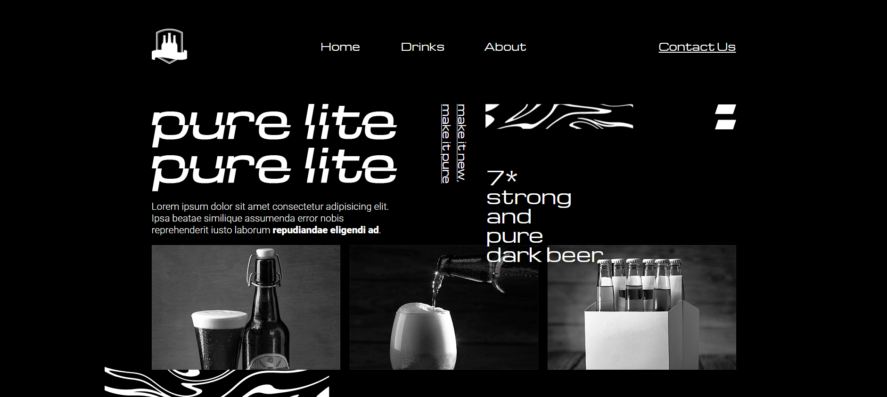

# "Pure Lite" markup training :muscle:

Humble example of landing page markup    
The second markup of mine, a little better than the previous one    

----
## Things I've improved over the [previous](https://github.com/IvanPostarnak/travel-blog-markup-training) attempt :chart:
* started using semantic tags of HTML
* names of CSS classes are getting better
* meet BEM methodology: started extracting repetitions of styles into independent blocks with their controlling modifiers
    
----
## Things I have NOT acchived from the last attempt :rotating_light:
* STILL a lot of CSS code repetitions
* STILL pixel-perfect (mostly)
* STILL not using any of CSS preprocessors
* STILL wasn't tested in every browser

----
## New things to improve: :exclamation:
* learn inheritance in case to prevent wasting re-inicialization

----
## Contacts
* [Vkontakte](https://vk.com/ivanpostarnak)
* ivan.postarnak.s@gmail.com